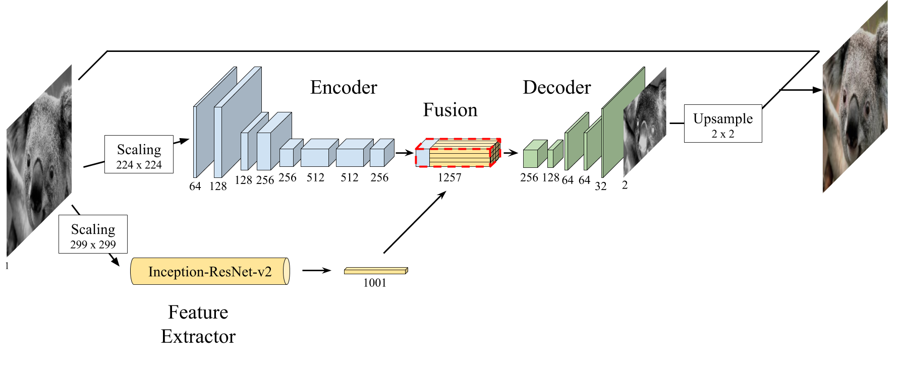
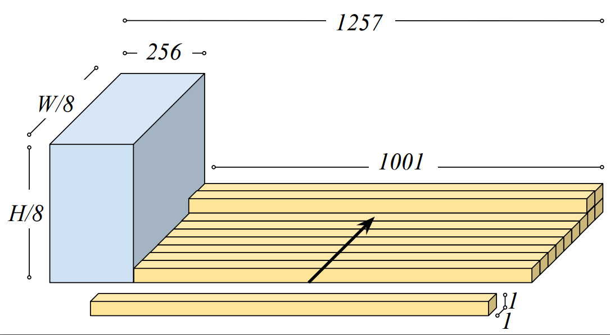
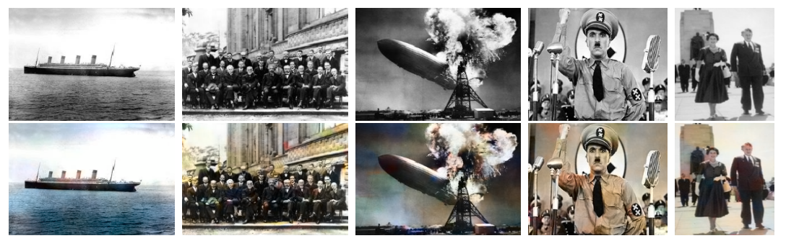

<h1 align="center" style="border-bottom: none;"> <a href="https://lcsrg.me/deep-koalarization">🐨 deep koalarization</a>
</h1>
<h3 align="center">Impementation of our paper <a href="https://arxiv.org/abs/1712.03400">Deep Koalarization: Image Colorization using CNNs and Inception-ResNet-v2 (2017)</a></h3>

<p align="center">
  <a href="https://github.com/baldassarreFe/deep-koalarization">
    
  </a>
</p>

<p align="center">
  <a href="https://www.python.org/downloads/release/python-360/"></a>
  <a href="https://github.com/baldassarreFe/deep-koalarization/blob/master/LICENSE"></a>
  <a href="https://github.com/baldassarreFe/deep-koalarization/stargazers"></a>
  <a href="https://github.com/baldassarreFe/deep-koalarization/network"></a>
    <a href="https://github.com/baldassarreFe/deep-koalarization"></a>
  <a href="https://arxiv.org/abs/1712.03400"></a>
  <a href="https://twitter.com/intent/tweet?text=Wow:&url=https%3A%2F%2Fgithub.com%2FbaldassarreFe%2Fdeep-koalarization"></a>
</p>


<p align="center">
  <a href="https://github.com/baldassarreFe">Federico Baldassarre</a><sup>*</sup>,
  <a href="https://github.com/diegomorin8">Diego Gonzalez Morín</a><sup>*</sup> and <a href="https://github.com/lucasrodes">Lucas Rodés-Guirao</a><sup>*</sup> 
</p>
<p align="center">
  <sup>* Authors contributed equally</sup>
</p> 


**deep-koalarization** was developed as part of the [DD2424 Deep Learning in Data Science course](https://www.kth.se/student/kurser/kurs/DD2424?l=en) at [KTH Royal Institute of Technology](https://www.kth.se/en), spring 2017.

The code is built using [Keras](https://keras.io) and [Tensorflow](https://www.tensorflow.org/).

Consider starring this project if you found it useful :star:!

### Table of contents

- [Citation](#citation)
- [Abstract](#abstract)
- [Project Overview](#project-overview)
- [Results](#results)
- [Use the code](#use-the-code)
- [Community](#community)

## Citation

If you find Deep Koalarization useful in your research, please consider citing our paper as

```
@article{deepkoal2017,
  author          = {Federico Baldassarre, Diego Gonzalez-Morin, Lucas Rodes-Guirao},
  title           = {Deep-Koalarization: Image Colorization using CNNs and Inception-ResNet-v2},
  journal         = {ArXiv:1712.03400},
  url             = {https://arxiv.org/abs/1712.03400},
  year            = 2017,
  month           = dec
}
```
[arXiv e-print](https://arxiv.org/abs/1712.03400)


## Abstract

We review some of the most recent approaches to colorize gray-scale images using deep learning methods. Inspired by these, we propose a model which combines a deep Convolutional Neural Network trained from scratch with high-level features extracted from the Inception-ResNet-v2 pre-trained model. Thanks to its fully convolutional architecture, our encoder-decoder model can process images of any size and aspect ratio. Other than presenting the training results, we assess the "public acceptance" of the generated images by means of a user study. Finally, we present a carousel of applications on different types of images, such as historical photographs.

<!---
## Intro
We got the inspiration from the work of Richard Zhang, Phillip Isola and Alexei A. Efros, who realized a network able to colorize black and white images ([blog post](https://richzhang.github.io/colorization/) and [paper](https://arxiv.org/abs/1603.08511)). They trained a network on ImageNet pictures preprocessed to make them gray-scale, with the colored image as the output target.

Then we also saw the experiments of Satoshi Iizuka, Edgar Simo-Serra and Hiroshi Ishikawa, who added image classification features to raw pixels fed to the network, improving the overall results ([YouTube review](https://www.youtube.com/watch?v=MfaTOXxA8dM), [blog post](http://hi.cs.waseda.ac.jp/~iizuka/projects/colorization/en/) and [paper](http://hi.cs.waseda.ac.jp/~iizuka/projects/colorization/data/colorization_sig2016.pdf)).
-->

## Project overview
Inspired by [Iizuka and Simo-Serra *et al.* (2016)](http://hi.cs.waseda.ac.jp/~iizuka/projects/colorization/data/colorization_sig2016.pdf), we combine a deep CNN architecture with [Inception-ResNet-v2](https://arxiv.org/abs/1602.07261) pre-trained on ImageNet dataset, which assists the overall colorization process by extracting high-level features. In particular, Inception-ResNet-v2



<!---
The hidden layers of these models are learned to create a semantic representation of the image that is then used by the final layer (fully connected + softmax) to label the objects in the image. By “cutting” the model at one of its final layers we will get a high dimensional representation of image features, that will be used by our network to perform the colorization task (TensorFlow [tutorial](https://www.tensorflow.org/tutorials/image_retraining) on transfer learning, another [tutorial](https://kwotsin.github.io/tech/2017/02/11/transfer-learning.html) and arXiv [paper](https://arxiv.org/abs/1403.6382)).
-->

The _fusion_ between the fixed-size embedding and the intermediary result of the convolutions is performed by means of replication and stacking as described in [Iizuka and Simo-Serra *et al.* (2016)](http://hi.cs.waseda.ac.jp/~iizuka/projects/colorization/data/colorization_sig2016.pdf).



We have used the MSE loss as the objective function.

The Training data for this experiment could come from any source. We decuded to use [ImageNet](http://www.image-net.org), which nowadays is considered the de-facto reference for image tasks. This way, it makes easier for others to replicate our experiments.

## Results

#### ImageNet


#### Historical pictures



---

## Use the code

Refer to [INSTRUCTIONS](INSTRUCTIONS.md) to install and use the code in this repo.

## Community

### Thanks to the people who noticed our work!

We are proud if our work gets noticed and helps/inspires other people on their path to knowledge. Here's a list of references we are aware of, some of the authors contacted us, some others we just happened to find online:

- François Chollet [tweeted](https://twitter.com/fchollet/status/917846097430638592) about this project (thank you for Keras)
- Emil Wallnér on [FloydHub Blog](https://blog.floydhub.com/colorizing-b&w-photos-with-neural-networks/) and [freecodecamp](https://medium.freecodecamp.org/colorize-b-w-photos-with-a-100-line-neural-network-53d9b4449f8d)
- Amir Kalron on [Logz.io Blog](https://logz.io/blog/open-source-machine-learning/)
- sparkexpert on [CSDN](http://blog.csdn.net/sparkexpert/article/details/74452523)
- Eryk Lewinson on [Medium](https://towardsdatascience.com/image-colorization-using-convolutional-autoencoders-fdabc1cb1dbe)

### Projects originated from here
- _[Coloring Black and White Images with Neural Networks](https://github.com/emilwallner/Coloring-greyscale-images)_, by [emilwallner](https://github.com/emilwallner).
- _[Ensemble Image Colorization using Convolutional Neural Networks with Refinement Network](https://github.com/Kriztoper/deep-koalarization)_, by [Kriztoper](https://github.com/Kriztoper).
